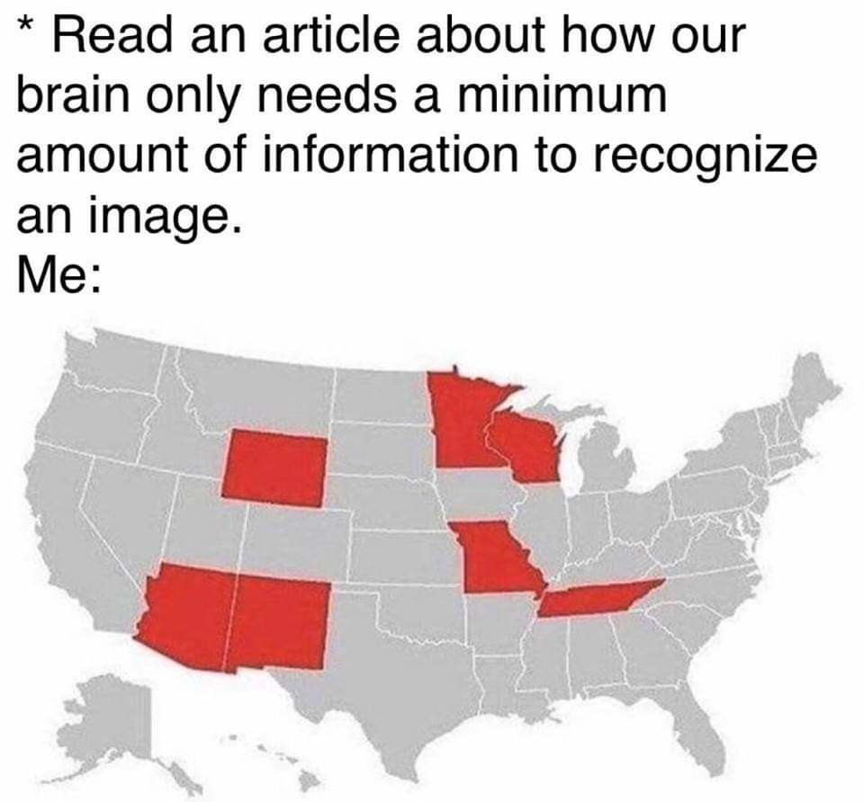

# Week 12 House Meeting

***Quorum is Met***

## Cabinet Announcements

Kel: Welcome to Week 12 House Meeting. I am pushing pres announcements to Carl

President - God Emperor for Leiah:

- Housing meeting is week after Thanksgiving break.
- Inter-SIH Overwatch tournament 12/8. Announcement is in Eboard Announcements channel. 

Vice President - Kel: Evals better be turned in. I am not gonna check for the rest of the night, so if you don't have them submitted, do it by the end of the night. If you don't, you better have a good excuse. 

Treasurer - Bench:

- Pizza Sale on the Monday after Thanksgiving. Gonna be passing around the sign up sheet next house meeting. 
- Also proposing a budget of $250 for stickers. 300 nice die-cut ones like we currently have, and 1000 less nice roll stickers. Passes 34-0-1

Secretary - Seth: I will be doing a filing cabinet organization party over break, come join me out of the goodness of your heart so I am not alone. 

RA - Adam: Tell Adam when you are leaving for Thanksgiving

Computer Chairman - Saty: Weather for this week: Cloudy on Monday with a high of 39, so computers are happy. On Tuesday, computers are neutral because it's snowing, but thanksgiving break starts that day. And for the rest of the week computers are happy since it's Thanksgiving break.

Constitution and Historian - Nicc: On this day in 1996, a world renowned and protector of exotic birds was sentenced to 7 years in prison without parole for running an illegal parrot smuggling ring. 

Freshmen Rep - Danny: Bottle run Monday around 6:30 PM 

House Improvements - Hunter: HIPAWAMIP

Public Relations - Jonathan:

- This Week

    - We raised over $100 through skating and can drives
    - 47 Total hours of community service

- Tuesday Nov 27 - Hunger Project
    
    - Help prepare 50,000 meals for local and international food banks
    - 1 hour shift available from 1-4 pm

- Keep the kitchen clean while I'm gone thanks!

Recruitment - Faith: We have a MECE shadow coming on the 30th! If you would like to help out and are a MECE or MECE Tech send me your schedule if you haven't already!

Social - Kristy:

- We had a snowball fight with CSH and it went well.
- Gender neutral girls night was also a lot of fun.
- Don't forget to start planning what you are gonna get for your nondenominational gift person  because everyone should know who they have as of this point if you have any questions come ask me or send me a message.
- Festivus is December 9th in the VAX after house meeting so make sure to get the gifts before then. 

Project - Trent: Absent. No announcements

ALC:

- Complaints:
   
    - Clock is broken
    - Kim's Sister stole her scarf, mom won't give it back
    - Snow is stupid, and people can't drive
    - I want to know what happens in Game of Thrones
    - Leiah isn't here, Nicc will make me deaf
    - Bench isn't buying enough stickers

- GTKYA:

    - Broseph

        - 4th year CE
        - Former Constitution Head
        - TA for the CE department
        - Can hold a credit card between his shoulder blades
        - Is very swole
        - Dangled out the window by Emerson
    
    - Zach (Crazy Mike) Roberts

        - 3rd Year MECE
        - On co-op in Rockford, Illinois
        - Wants to get his pilot’s licence
        - Would fly here if he had said pilot’s license 
        - On the climbing team
        - Makes sure to turn off headlights to not spook deer
        - Eagle Scout
    
    - George Thompson

        - 3rd year MECE
        - Goes by Mika
        - Currently on co-op
        - Is good at cars
        - Lives in Rochester
        - Drove around Watkins Glen Race Track in a rally car

## General Announcements

Kristy: SPORTS: We won soccer because the other team didn't show. We are second going into playoffs. First playoff game is 11/29, they gave me a concussion

Carl: OTHER SPORTS: Broomball is a small enough league, we made playoffs. That will be 11/23 (but that's during break)

Faith: Pay me for T-Shirts

David: Who would be interested in EHouse bottle openers

Michael: Would people be interested in EHouse pins?

Nicc: Human Hamster Wheel: 

- We didn't do anything this week. 
- North side men's users, TAKE STEAMY SHOWERS
- If you hit your head, I am sorry (@Seth)
- SPORTS: We are the ultimate champions.

Hunter: 

- SPOOF: Not happening this week
- Giant 3D printer happened this week, we build a box. No meeting this week. 

Howie: Thanks to everyone who came to FLL

Dante: Thanks for everyone who donated cans. 20 Participants and 120 cans. 

Kel: We are watching the Thanksgiving special for Pixar Night. At My house in Ocean Grove, Jersey. That was a joke, I am not actually watching it. Next week will be _Brave_.

Jessie: I am watching Charlie Brown Thanksgiving special on Tuesday at 9pm

Ryan: ESports: I want to put together a LoL team for next semester. If you are interested, let me know. 

Seth: Who wants to do Pi Tau Sigma dodgeball?

### Seth's Favorite Meme of the Week

